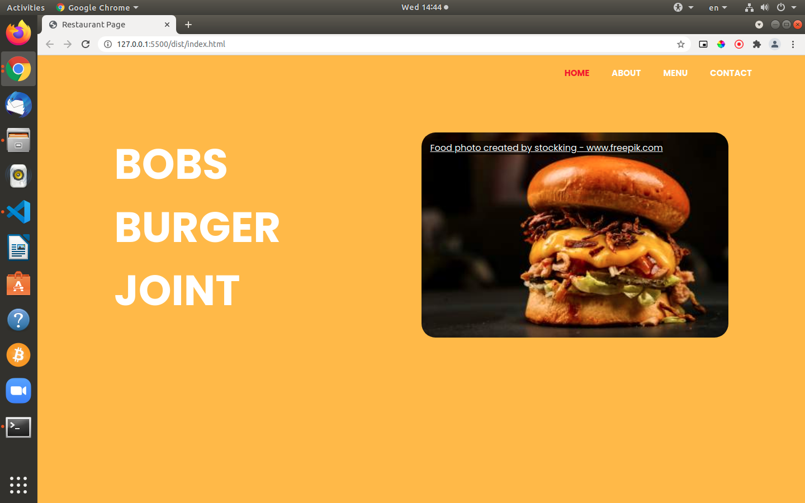

# Restaurant Page

> This project is a basic webpage built using Webpack. This is an assignment taken from _The Odin Project_. The main purpose of this project was to learn about Webpack.

### Screenshot:



# Live Preview

[View Project](https://rawcdn.githack.com/jacobrees/Restaurant-Page/1ade59a8341f235f666bfcc32442d34dc47cd23e/dist/index.html)

# Getting Started

To get a local copy of the repository please run the following commands in your terminal:

```
$ cd <folder>
```

```
$ git clone git@github.com:jacobrees/Restaurant-Page.git
```

To launch an instance of this app. Inside of your terminal you will need to navigate into the repository you have just cloned. You will then need to navigate into the dist directory. You will do this by using `cd` inside of your terminal. 

Once you are inside of this folder run the command `google-chrome index.html` and this will open the project in Google Chrome (substitute google-chrome for your prefered web browser if you wish to open in a different browser). 

Below shows the following commands you will need to run to achieve this:

```
$ cd Restaurant-Page
```

```
$ cd dist
```

```
$ google-chrome index.html
```

## Built With

- HTML
- SCSS
- JavaScript
- Webpack

## Authors

👤 **Jacob Rees**

- Github: [@jacobrees](https://github.com/jacobrees)
- Linkedin: [jacob-rees-a6507b1a6](https://www.linkedin.com/in/jacob-rees-a6507b1a6/)


## 🤝 Contributing

Contributions, issues and feature requests are welcome!

## Show your support

Give a ⭐️ if you like this project!

## Acknowledgments

- Project inspired by The Odin Project
- Code linters used within this project have been developed by Microverse
